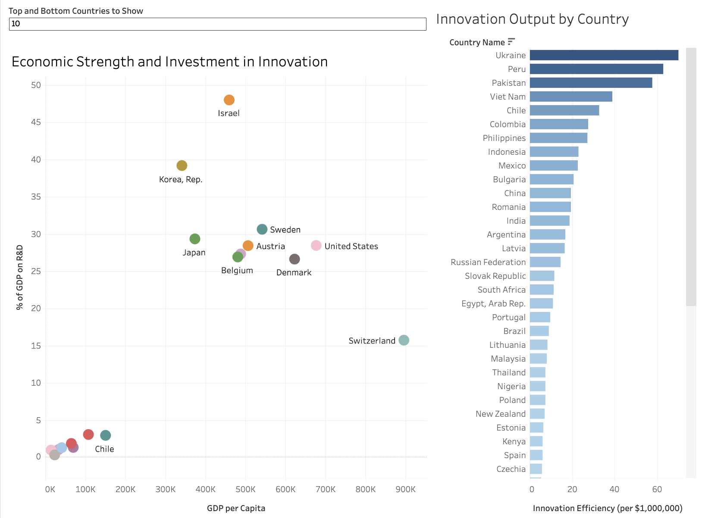
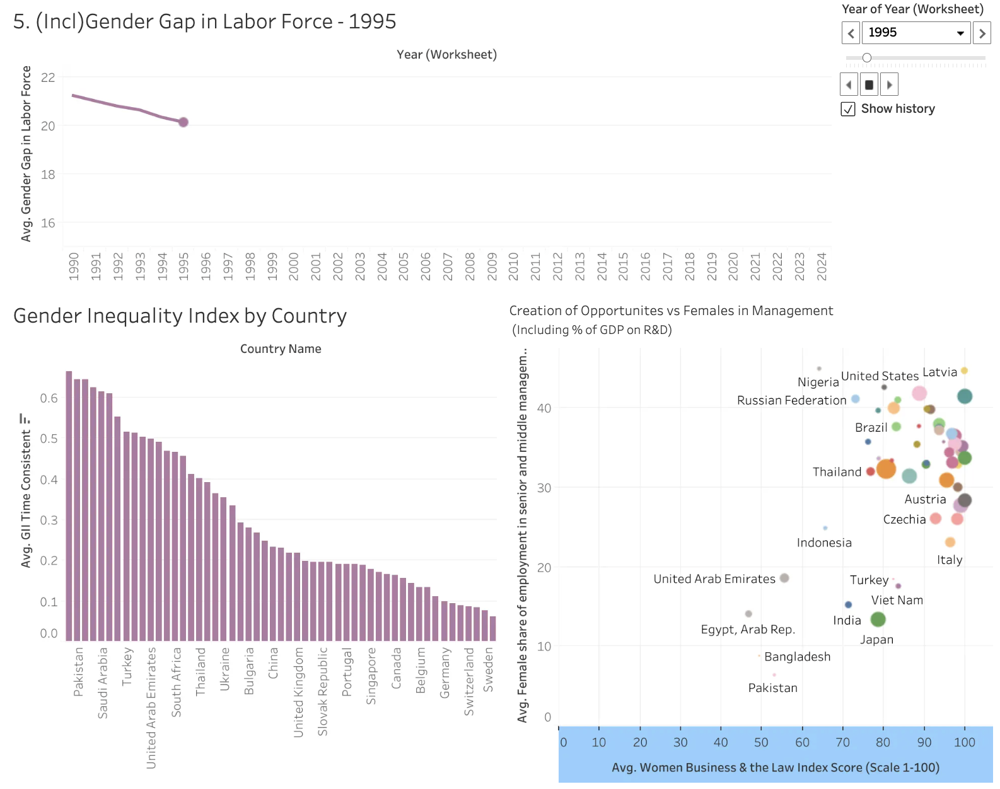
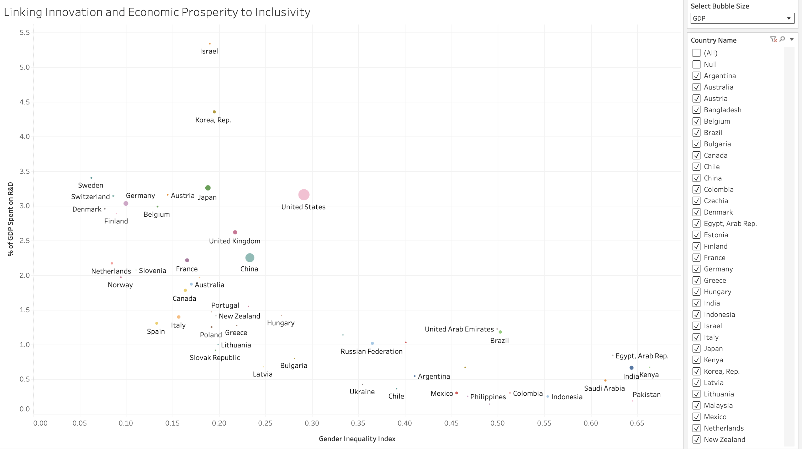
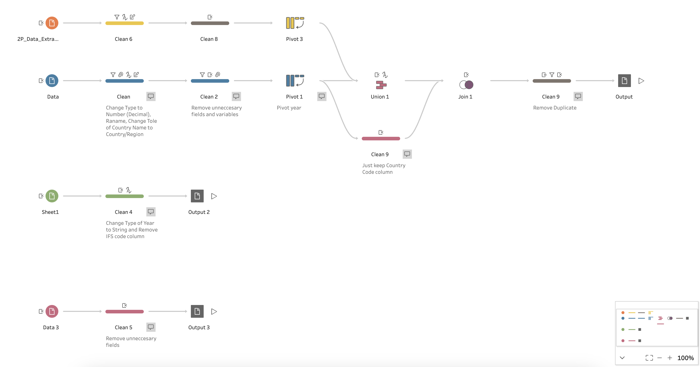

# Global Innovation & Economic Inclusion Analysis

## Overview
Cross-country analysis examining how innovation investment, economic performance, and workforce inclusion are related across countries.

The project combines economic and social indicators from the World Bank, IMF, and UNESCO and uses Tableau and Tableau Prep to transform the data into interactive visual analyses.

## Business Questions
- Do innovation-driven economies demonstrate higher levels of workforce inclusion?
- How are innovation investment and economic performance related across countries?
- What relationships exist between gender inclusion, leadership representation, and economic outcomes?

## Tools
- Tableau
- Tableau Prep
- Data Visualization
- Data Cleaning & Integration
- Exploratory Data Analysis

## Data Sources
- World Bank – World Development Indicators
- International Monetary Fund (IMF) – Gender Inequality Data
- UNESCO Institute for Statistics – Research & Development Data

## Analysis
The analysis combines indicators including:

- GDP and GDP per capita
- Research & development expenditure
- Innovation output
- Female labor-force participation
- Female representation in management
- Gender Inequality Index
- Tertiary education enrollment

Interactive Tableau dashboards were developed to compare economic strength, innovation investment, innovation efficiency, and workforce inclusion across countries.

## Dashboard Highlights

### Innovation Dashboard

### Inclusion Dashboard

### Innovation, Prosperity & Inclusivity

### Tableau Prep Workflow

## Key Findings
- Higher economic strength did not always translate into greater R&D investment, highlighting differences in national innovation strategies.
- Countries with lower gender inequality generally showed higher levels of innovation investment.
- Female inclusion varied significantly across labor participation, leadership representation, and legal frameworks.
- Innovation and inclusion appeared interconnected, although country-specific economic and structural factors remained important.

## Project Files
- [Final Report](report/global-innovation-economic-inclusion-report.pdf)
- [Tableau Dashboard Workbook](tableau/global-innovation-economic-inclusion-dashboard.twbx)
- [Tableau Prep Flow](tableau/global-innovation-economic-inclusion-prep-flow.tflx)
